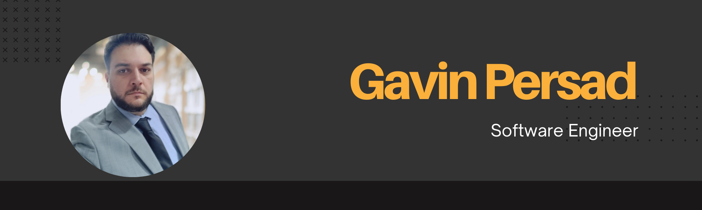

 
 

👋 Hi! I’m Gavin 👋

🌐 Background:
Former property manager turned tech enthusiast.
Passionate about coding, with a gaming background.

🚀 Recent Achievement:
Successfully completed a 16-week developer bootcamp.
Rapid skill acquisition and effective teamwork were key.

🎸 Fun Fact:
I’ve been playing bass guitar in the same band for 20 years.

⚽ Football Enthusiast:
A devoted Tottenham Hotspur fan.
Also love football simulation games (10+ years of online team play).

🏃‍♂️ Charity Supporter:
Participate in sponsored walks for national and local charities.
Raised £2000 for children’s cancer research in the Shine Marathon last year.

🌟 Passion:
Connecting with people and making a positive impact.

 
 

 

